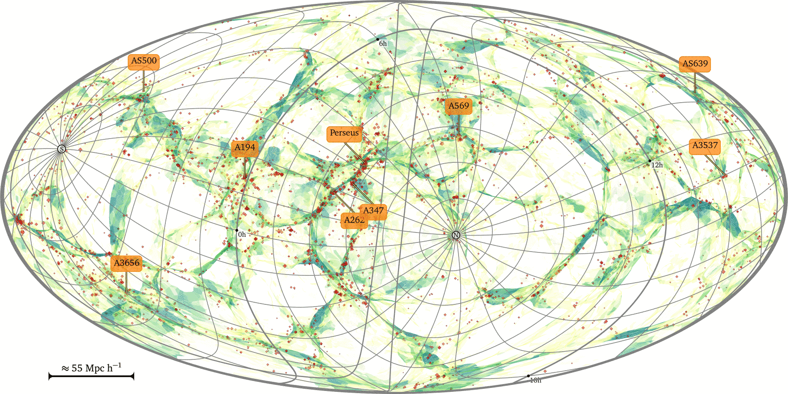

# Complex Systems

## How I got interested

- Thesis work into origins of complexity in Universe
    - [Hidding et al '14](https://ui.adsabs.harvard.edu/link_gateway/2014MNRAS.437.3442H/PUB_PDF)
- Utrecht Summerschool
- General curiosity
    - A generic shift in science

## Cosmology

## Complex systems ... and

- Physics
- Biology
- Economics
- Meteorology
* Sociology

## Boundaries between sciences

- From biochemistry to cellbiology
- From taxonomy to ecology
- From psychology to sociology

## What is a complex system?

<ul>
<li> Simple microscopic rules of interaction </li>
<li class="fragment"> Emergent large scale behaviour:

- scaling laws
- pattern formation
- synchronisation
- self-replication
- co-evolution
- non-linear / chaotic
- robustness
- path-dependence
</li></ul>

## Science

- Differential equations, (statistical physics)
- Statistical inference
- "Science" in a computational universe
    1. Set ground rules
    2. Run simulations $\leftarrow$ NLeSC! everyone knows
    3. Identify large-scale behaviour $\leftarrow$ NLeSC?
    5. New concepts
    4. Match with nature, gain insight! $\leftarrow$ NLeSC?

# Increasing complexity

## From physics

<!-- https://arxiv.org/vc/arxiv/papers/1302/1302.4378v1.pdf -->
- Simple pendulum
- Double pendulum: chaos
    - [demo](https://jhidding.github.io/chaotic-pendulum)
- Dynamics on networks
    - synchronisation: [metronomes](https://www.youtube.com/watch?v=5v5eBf2KwF8)
    - lampyridae: [demo](https://ncase.me/fireflies/)

## Ecology

<!-- https://dspace.library.uu.nl/bitstream/handle/1874/25708/rietkerk-04-self+organised.pdf?sequence=2 -->
- Start out with one-dimensional model (predator/prey type)
- Add spatial component
- Pattern formation
    - self organisation
    - [Rietkerk '04](http://www.uvm.edu/pdodds/files/papers/others/2009/scheffer2009a.pdf)

# That's it (for now)
